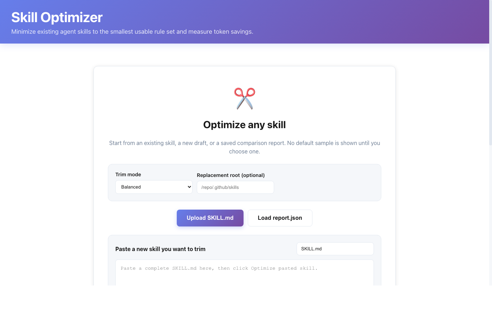

# Skill Optimizer

Ablation-tested SKILL.md optimization — slash token costs by 70-90% while keeping what actually works.

> **Problem**: Unchecked skills = more tokens = higher costs + worse outputs. **Solution**: Ablate ruthlessly, measure impact.



## Why This Exists

Most skill makers keep adding rules "just in case" — never measuring the impact.

**The truth**: Most rules in your SKILL.md are noise. Examples. Duplicates. Tutorials. They bulk up your context but change nothing in the output.

Skill Optimizer removes the fluff, keeps the logic.

## Results (Real Ablation Tests)

### anthropics/skills (17 skills)

| Skill | Original | Trimmed | Reduction |
|-------|----------|---------|----------|
| algorithmic-art | 128 | 33 | **74%** |
| brand-guidelines | 28 | 7 | **77%** |
| mcp-builder | 78 | 12 | **85%** |
| pptx | 52 | 13 | **77%** |
| slack-gif-creator | 55 | 16 | **72%** |
| theme-factory | 24 | 4 | **85%** |
| web-artifacts-builder | 17 | 1 | **96%** |
| doc-coauthoring | 83 | 35 | **58%** |
| skill-creator | 85 | 60 | **30%** |

> **17 skills, 2,338 tokens saved** — avg 138 tokens/skill

### Eronred/aso-skills (40 skills)

| Skill | Original | Trimmed | Reduction |
|-------|----------|---------|----------|
| app-launch | 958 | 58 | **94%** |
| competitor-analysis | 512 | 89 | **83%** |
| android-aso | 421 | 114 | **73%** |
| app-analytics | 280 | 64 | **77%** |

> **40 skills, 4,786 tokens saved** — avg 120 tokens/skill

Both repos tested with `balanced` mode. Each skill still functions — only noise removed.

## Quick Start

```bash
# One command to clone, trim, and visualize
python3 -m cli.main trim-skill --clone user/repo

# Example
python3 -m cli.main trim-skill --clone Eronred/aso-skills
```

Done. Dashboard opens auto.

## Installation

```bash
# User install
python3 -m pip install --user .

# Or dev mode
python3 -m pip install -e .
```

## Usage

```bash
# Clone repo + trim all skills
skill-optimizer trim-skill --clone user/repo

# From GitHub URL
skill-optimizer trim-skill --url https://github.com/user/repo

# From local file
skill-optimizer trim-skill --skill ./my-skill/SKILL.md
```

### Trim Modes

| Mode | Reduction | Safety |
|------|-----------|--------|
| `aggressive` | ~90% | Remove almost everything |
| `balanced` | ~80% | Recommended |
| `strict` | ~60% | Keep most rules |

## How It Works (Ablation Testing)

1. **Classify** each rule as: directive, constraint, reference, example, or duplicate
2. **Remove** low-signal content (examples, tutorials, dupes)
3. **Keep** what changes behavior (must, ensure, limits)
4. **Verify** with task-specific prompt patterns

Inspired by [Anthropic's ablation research](https://www.anthropic.com/engineering/ablation) — test what actually matters.

The report shows exactly why each rule was kept or removed — you're in control.

## Dashboard

```bash
cd dashboard
npm install
npm run dev
```

- Drag & drop reports
- See keep/remove decisions
- Export trimmed skills

## Why Skill Makers Don't Test

- No tooling = manual work
- "More rules = better" myth
- Fear of breaking anything
- No way to measure impact

You have better things to do than read SKILL.md files line-by-line. Let the tool do it.

## License

MIT — See [LICENSE](LICENSE)

---

Made with ❤️ by [@therahulgoel](https://x.com/therahulgoel)