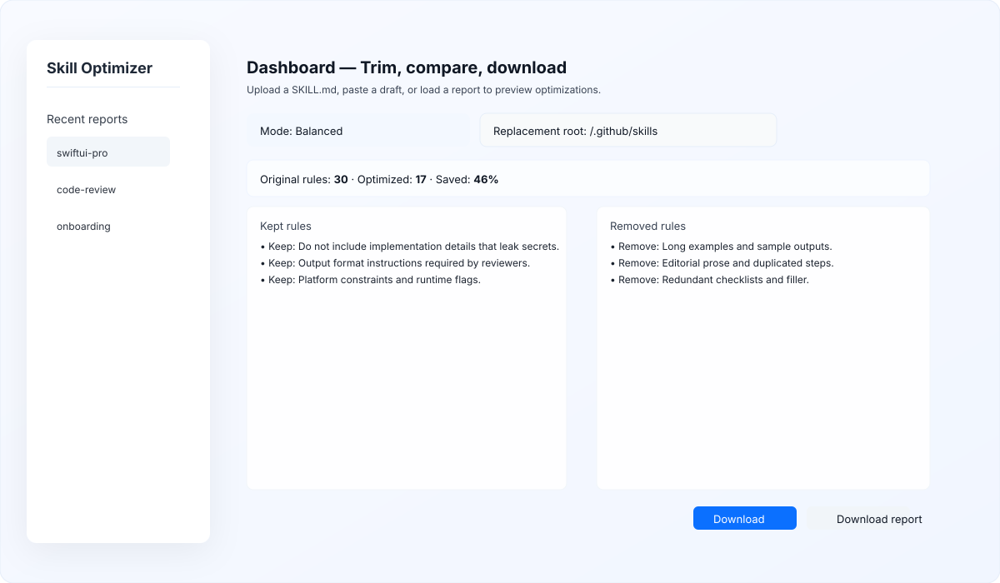

# Skill Optimizer

Trim and minimize `SKILL.md` and `AGENTS.md` files — reduce token costs and simplify agent skills.



Why use Skill Optimizer?
- Save tokens: smaller skills reduce prompt size and model cost.
- Safer edits: reviewable keep/remove decisions with reasons.
- Team-ready: batch mode, replacement helpers, and consistent modes.

Quick start

CLI (fast):
```bash
pip install -e .
skill-optimizer trim-skill --skill /path/to/SKILL.md --output results/ --mode balanced
```

Dashboard (visual):
```bash
# optional: copy a sample report for quick preview
cp results/skill_trim_report.json dashboard/public/skill_trim_report.json
cd dashboard
npm install
npm run dev
# open http://localhost:3000
```

Notes
- Modes: `strict`, `balanced` (default), `aggressive`.
- Batch: `trim-folder --skills-dir path --output results/ --mode balanced`.
- See [QUICK_REFERENCE.md](QUICK_REFERENCE.md) for examples and advanced usage.

License: MIT — see [LICENSE](LICENSE)

Made with ❤️ by [@therahulgoel](https://github.com/therahulgoel)

